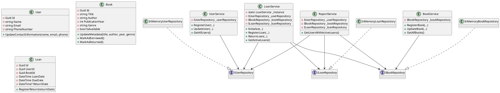

# Diseño orientado a objetos

## Arquitectura general

La solución se dividió en tres capas lógicas:

1. **Capa de dominio (`BookWorld.Core`)**: contiene entidades, excepciones, modelos de reporte, repositorios y servicios que encapsulan la lógica de negocio.
2. **Capa de presentación (`BookWorld.App`)**: aplicación de consola que orquesta los servicios y ofrece un menú interactivo para el bibliotecario.
3. **Capa de pruebas (`BookWorld.Tests`)**: proyecto xUnit que valida los escenarios críticos del dominio.

## Diagrama de clases UML

## Modelo de datos

- **Usuarios**: identificados por `Guid`, se almacenan con nombre, correo y teléfono.
- **Libros**: identificados por `Guid`, mantienen título, autor, año de publicación, género y el estado `IsAvailable`.
- **Préstamos**: registran las relaciones `UserId` y `BookId`, junto a las fechas de préstamo, vencimiento y devolución.

## Flujos principales

1. **Registro de usuario/libro**: la capa de presentación captura los datos y delega al servicio correspondiente. El servicio valida y persiste mediante los repositorios en memoria.
2. **Préstamo**: el `LoanService` (Singleton) valida límites, verifica disponibilidad, crea el préstamo y actualiza el estado del libro.
3. **Devolución**: el `LoanService` ubica el préstamo activo, registra la devolución y marca el libro como disponible.
4. **Reporte**: el `ReportService` consolida información de usuarios, libros y préstamos para entregar una vista agregada.

## Consideraciones de extensibilidad

- Los repositorios en memoria pueden reemplazarse por implementaciones conectadas a bases de datos sin modificar los servicios.
- El menú de consola puede evolucionar a una interfaz gráfica reutilizando exactamente los mismos servicios.
- La clase `LoanService` expone `MaxActiveLoansPerUser`, permitiendo parametrizar fácilmente el límite de libros por usuario.
